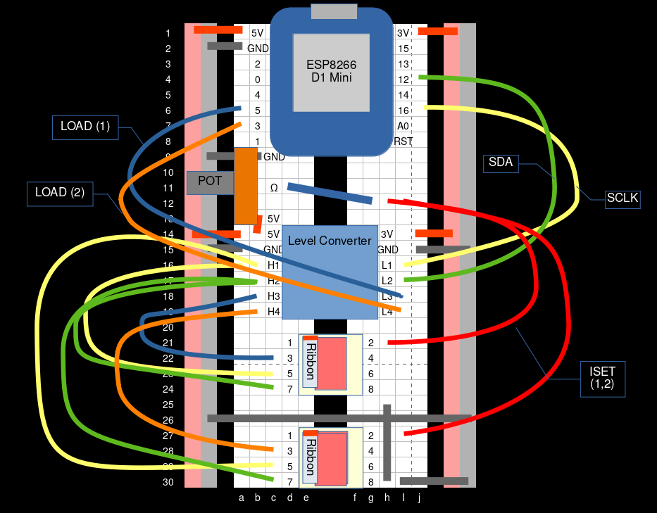

# Bus Signs

plan:

- bus signs which have an API that you can POST to
- lots to do

Based on code from <https://github.com/ConnectedHumber/Bus-Terminal-Signs>.

## Breadboard

Using an ESP, you can get Wi-Fi, but it outputs only 3.3V logic, which you can use a level converter to shift to 5V logic. You might have to slow down the polling rate to make sure it is correctly sent.

For the 1-8 pin meanings of the ribbon cables, see: <https://github.com/ConnectedHumber/Bus-Terminal-Signs?tab=readme-ov-file#pin-designation>

