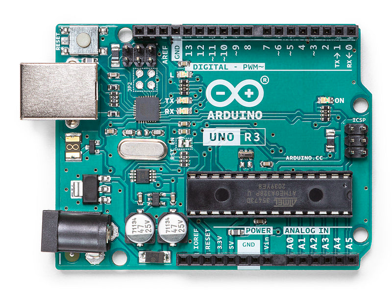
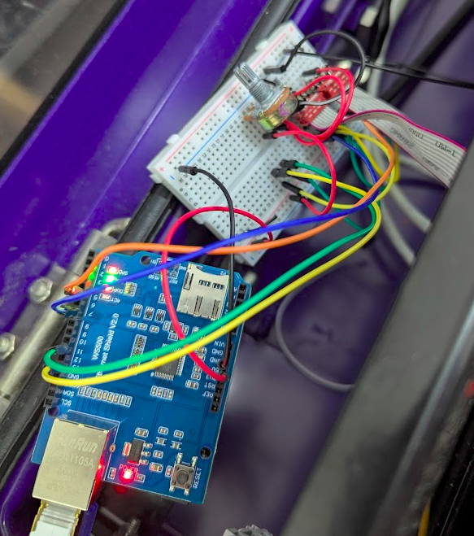

# Bus Signs

Based on code from <https://github.com/ConnectedHumber/Bus-Terminal-Signs>.

| | name | function |
| --- | --- | --- |
|  | Arduino Uno R3 | microcontroller with logic |
|  | WizNet W5500 Ethernet Shield | provides networking to Arduino |
|  | sign connection | connects Arduino to sign |

## Controller

see [controller/README.md](./controller/README.md)

```bash
# enter directory
cd controller
# upload tests to Arduino
pio run -e blink -t upload
pio run -e testblink -t upload
pio run -e scrolling -t upload
pio run -e test-ethernet-http-fetch -t upload
pio run -e test-ethernet-http-listen -t upload
# upload code to Arduino
pio run -e test-ethernet-sign -t upload
```
