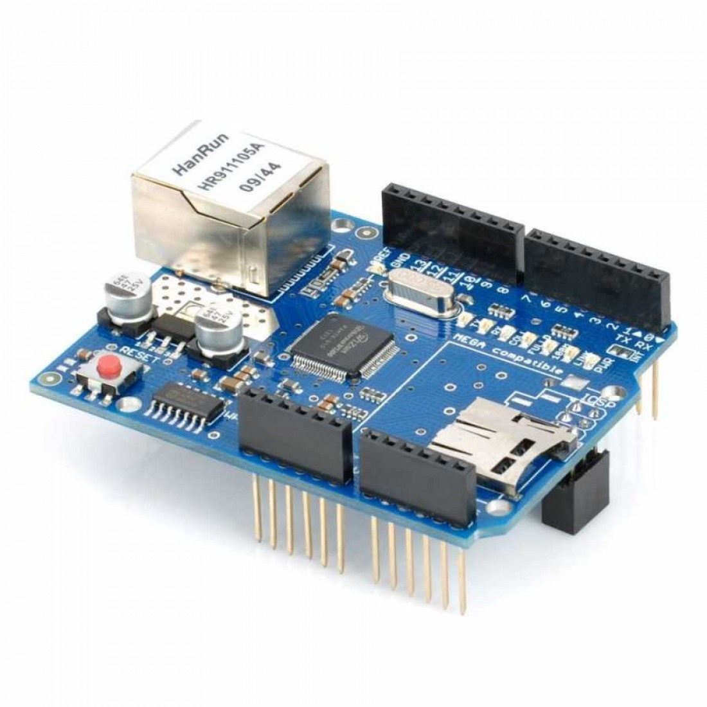
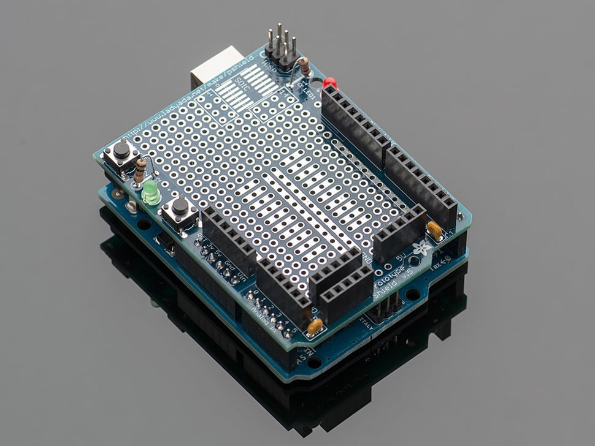
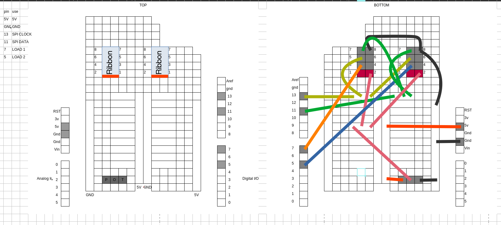
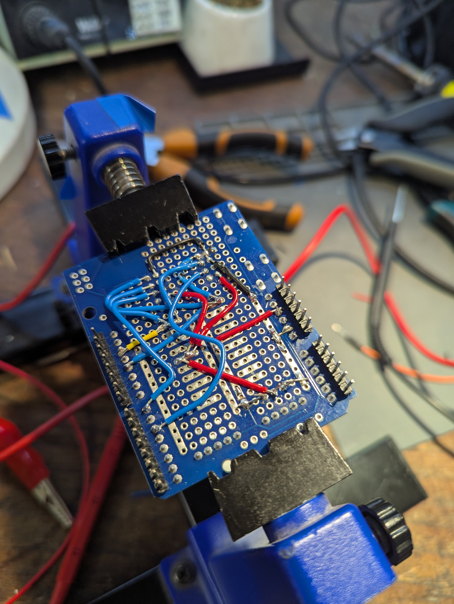
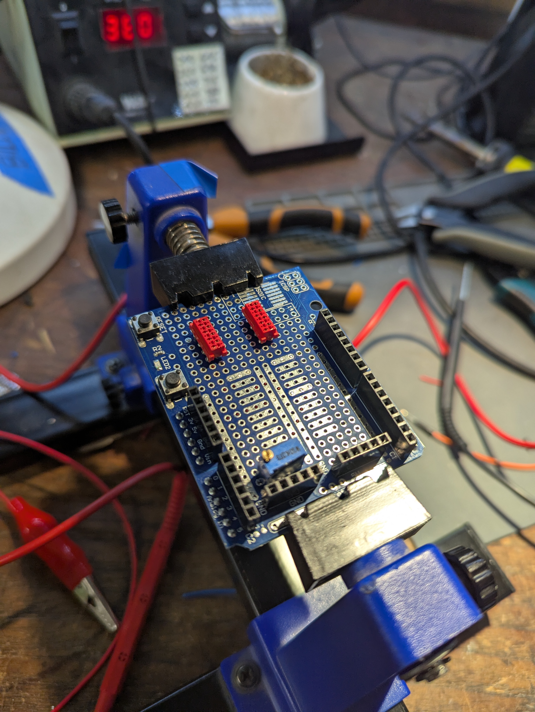

# Bus Signs

Based on code from <https://github.com/ConnectedHumber/Bus-Terminal-Signs>.

1. [Notes](#notes)
2. [Screen size](#screen-size)
3. [Arduino pins used](#arduino-pins-used)
4. [Programming the Arduino](#programming-the-arduino)
5. [Sending commands to the sign over Ethernet](#sending-commands-to-the-sign-over-ethernet)
6. [Components for control](#components-for-control)
   1. [Arduino Uno R3](#arduino-uno-r3)
   2. [WizNet W5500 Ethernet Shield](#wiznet-w5500-ethernet-shield)
   3. [Proto shield with custom sign connection](#proto-shield-with-custom-sign-connection)
   4. [Miscellaneous bits](#miscellaneous-bits)

## Notes

[./networker/](./networker/) is not used, but kept for posterity. It is from an old idea of using an ESP over Serial to send commands to the Arduino controlling the sign, but now we use Ethernet straight on the Arduino.

## Screen size

2 × [192 × 8] (actually 192×9 but only 8 drivable…?)

## Arduino pins used

| pin | for |
| --- | --- |
| 5V | power |
| GND | GND |
| 11 | SPI CLOCK |
| 13 | SPI DATA OUT |
| 5 | LOAD PIN 1 |
| 7 | LOAD PIN 2 |

## Programming the Arduino

```bash
# enter directory
cd controller

# upload tests to Arduino
pio run -e blink -t upload
pio run -e testblink -t upload
pio run -e scrolling -t upload
pio run -e test-ethernet-http-fetch -t upload
pio run -e test-ethernet-http-listen -t upload

# upload code to Arduino
pio run -e test-ethernet-sign -t upload
```

## Sending commands to the sign over Ethernet

```bash
# to-do
```

## Components for control

### Arduino Uno R3


### WizNet W5500 Ethernet Shield



### Proto shield with custom sign connection



See connection layout in [`layout.ods`](layout.ods). POT is a 10k potentiometer.







### Miscellaneous bits

- Ethernet cable
- USB cable
- bus sign
